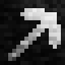

# Bedrock Breaking

A Fabric mod that allows Bedrock to be broken. Much configuration!

This mod has 2 non-loader dependencies ([Fabric Language Kotlin](https://www.curseforge.com/minecraft/mc-mods/fabric-language-kotlin) and [the Fabric API](https://www.curseforge.com/minecraft/mc-mods/fabric-api)), and ships with a copy of [ParadoxConfig](https://github.com/RedstoneParadox/ParadoxConfig).

## Config file
**Defaults:**
```json
{
  "bedrock_breakers": [
    "bedrockbreaking:bedrock_pickaxe",
    "minecraft:diamond_pickaxe"
  ],
  "bedrock_drops": false,
  "bedrock_effective_hardness": 50.0,
  "bedrock_pickaxe_enabled": true,
  "use_effective_modifier": false
}
```

By default, a Bedrock Pickaxe item is added (without a crafting recipe or creative tab, ID: `"bedrockpickaxe:bedrock_pickaxe"`). 

To remove it, set:
```json
"bedrock_pickaxe_enabled": false
```


Difficulty of breaking Bedrock is configurable, based on Minecraft hardness values:

```json
"bedrock_effective_hardness": 50.0
```

Any item can be made to break bedrock:
```json
  "bedrock_breakers": [
    "bedrockbreaking:bedrock_pickaxe",
    "minecraft:diamond_pickaxe"
  ]
```
If items other than the Bedrock Pickaxe are selected, you may want to set:

```json
"use_effective_modifier": false
```
Otherwise, everything that isn't a Bedrock Pickaxe will be “ineffective” on Bedrock, and mine at 30% the speed.

The Efficiency enchantment works properly. The Fortune enchantment will not work.

## License

This mod is released under the CC0 license. Nokko made it. 

## Notes
This is the first mod I made for Fabric 1.16.4! Mixins are awesome.

To people looking at this code for reference:

* Bedrock is made breakable by the `AbstractBlockMixin`.
    * It *shouldn't* break anything, but it does hook into the piece of code that runs every time you break a block, so... beware, potential bugs abound.
* The item is just a reskinned vanilla pickaxe. It breaks more quickly when being used to mine Bedrock.
* Configs will be in your `.minecraft/config/bedrockpickaxe/` directory or similar, look for `bedrockpickaxe.json`.
